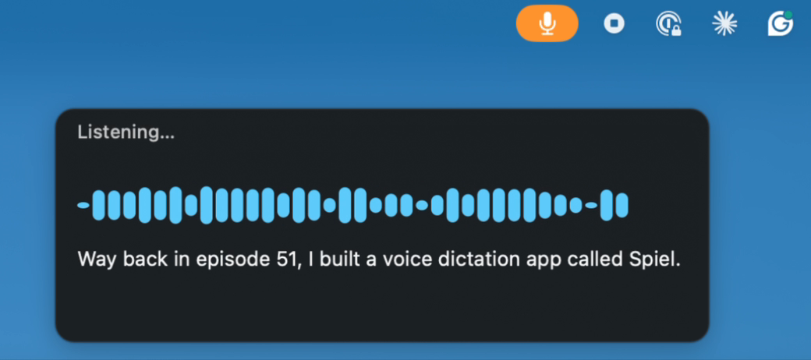
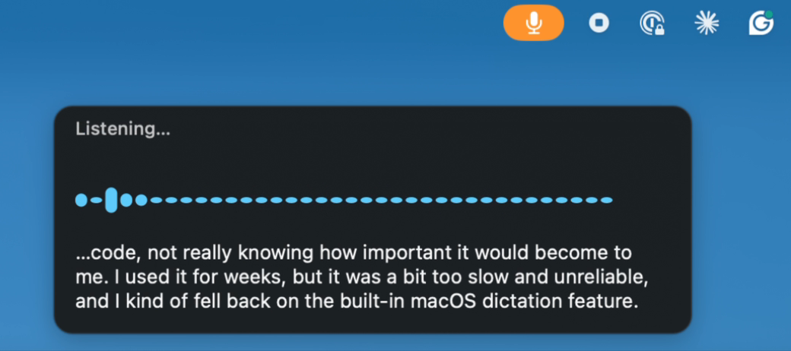

# Spiel v2 — native

A ground-up Swift rewrite of Spiel's engine, living alongside the original Electron
app on the `v2-native` branch. Nothing in `electron/` or `src/` was touched.

## What it looks like

Hold the hotkey, talk, let go. The text lands in whatever had focus.


Three moments from that clip:

| Idle | Mid-sentence | Done |
|---|---|---|
|  |  |  |

Everything in that panel ran on the laptop — Parakeet on the Neural Engine, no
network, no API key. (Yes, it heard "Claude Code" as "clawed code". Local models
have opinions.)

## Listen — whole-meeting transcription (2.1.0)

Press **⌘⇧L** (or menu → Start Listening). A tall panel appears at the right edge of
the screen with an editable title (pre-filled from the frontmost window — Teams puts
the meeting name there), a level meter, a running counter (`Listening · 47:12 ·
6,200 words`) and the transcript growing paragraph by paragraph, newest at the bottom.
It keeps going until you press ⌘⇧L again or click Stop. Pause is a button.

- The transcript is written to `~/Documents/Spiel/Transcripts/<date> <time> <title>.md`
  every 30 s and on every paragraph break (atomic temp-file + rename, mode 0600), so a
  crash at minute 58 loses at most the paragraph in progress. YAML frontmatter
  (`started`/`ended` ISO 8601 with offset, `words`, `input_device`, `engine`), then
  `[MM:SS]` paragraphs. Editing the title renames the file.
- Paragraphs split on a pause of 2 s or more (and every 90 s in a monologue). A pause
  that long also drops the engine's carried decoder context, so a sentence after a long
  silence does not inherit the previous one's state.
- Markers are their own lines: `[paused 4 min]`, `[input changed to AirPods at 31:07]`,
  `[missed ~8 s at 31:07]` (a segment the engine failed on — a gap, not a stop).
- Offsets come from the audio sample counter, never the wall clock, with pauses added
  back so `[31:07]` means 31 minutes into the meeting.
- Mic-only. The Yeti hears both sides of a call played through speakers; there is no
  system-audio tap and no speaker separation.
- ⌘⇧D during Listen is refused with a reason (one microphone, one session). Listen never
  pastes, never touches Secure Input, and never writes audio to disk — text only.
- When you stop, the panel shows the summary and Copy (plain text) / Open (the file) /
  Done. Nothing else happens with the file; it is yours.

**Also changed for dictation:** capture now restarts itself when the audio route changes
mid-run (AirPods connect, a USB mic unplugs, the default input is switched), instead of
going quiet.

## Why a rewrite rather than an engine swap

The three long-standing complaints about v1 are all **architecture**, not model
quality, so changing the transcription API inside the Electron app would have fixed
none of them:

| Symptom | v1 cause | v2 fix |
|---|---|---|
| "It doesn't always turn on" | `globalShortcut.register()` returning `false` was handled with a `console.error` and a `// Could show an alert` TODO. Registration is system-exclusive, so a conflict left a live-looking menu bar with a dead hotkey. | `HotkeyManager` surfaces every failure: warning icon in the menu bar, a notification, the reason in the menu, and a one-click "Try F5 instead". |
| "Doesn't work right in some apps" | `osascript … keystroke "v"` per insertion, refocus by app *display name*, clipboard restored on a flat 100 ms timer, and only `readText()` saved — so an image on the clipboard was destroyed. | Two-tier insert: Accessibility `kAXSelectedTextAttribute` **with read-back verification**, falling back to `CGEvent` Cmd+V. Refocus by `NSRunningApplication` (pid). All pasteboard flavors preserved. Secure Input detected and reported. |
| CPU | A `requestAnimationFrame` loop at ~60 Hz calling a Zustand setter every tick, re-rendering the whole React tree inside a transparent `backdrop-blur` always-on-top window. Plus a renderer process kept resident forever after first use. | No Electron. Plain `NSPanel`, one custom view, redraw throttled to 15 Hz, no blur. VAD moved off the render loop entirely. |

Two accuracy bugs are also fixed:

* **Out-of-order sentences.** v1 appended transcription results in *completion* order,
  so two concurrent segments could swap. `TranscriptAssembler` stamps each segment at
  capture time and only releases a contiguous prefix.
* **Stale audio on every segment.** v1 saved the session's first 100 ms WebM chunk and
  prepended it to every later segment so the file would decode — shipping a duplicated
  fragment of the session opening each time, with a non-monotonic timeline. It also
  cleared its chunk buffer the instant speech was detected, discarding the start of the
  word. v2 works in raw `[Float]` PCM, so there is no container to repair, and keeps a
  300 ms pre-roll so onsets survive.

## Layout

```
native/
├── Package.swift
├── Sources/
│   ├── SpielCore/          # engine-agnostic library
│   │   ├── Transcriber.swift          # protocol, TranscriptSegment, errors
│   │   ├── ParakeetTranscriber.swift  # FluidAudio / Parakeet TDT on the ANE
│   │   ├── AppleSpeechTranscriber.swift # macOS 26 SpeechAnalyzer
│   │   ├── AudioCapture.swift         # AVAudioEngine → 16 kHz mono float
│   │   ├── AudioSink.swift            # order-preserving, re-armable audio handoff
│   │   ├── VoiceActivityDetector.swift # energy-based speech gate
│   │   ├── DictationSession.swift     # VAD → segment → transcribe → assemble (+ timing on events)
│   │   ├── TranscriptAssembler.swift  # speech-order reassembly
│   │   ├── TranscriptDocument.swift   # Listen transcript: paragraphs, markers, frontmatter (pure)
│   │   ├── TranscriptStore.swift      # ~/Documents/Spiel/Transcripts, atomic saves
│   │   ├── HotkeyManager.swift        # Carbon global hotkeys (⌘⇧D dictation, ⌘⇧L listen), failure surfaced
│   │   ├── WindowTitle.swift          # frontmost window title via AX (default Listen title)
│   │   ├── Glossary.swift             # custom-vocabulary post-pass
│   │   ├── TextInserter.swift         # AX + CGEvent insertion
│   │   └── DiagnosticLog.swift        # ~/Library/Logs/Spiel.log (off by default; menu → Diagnostic Logging)
│   ├── SpielCLI/           # headless harness (spiel-cli)
│   │   ├── main.swift                 # selftest/doctor/glossary/transcribe/live
│   │   └── SelfTest.swift             # the only test harness (no XCTest here)
│   └── SpielApp/           # menu-bar app
│       ├── main.swift                 # AppDelegate, menu, dictation + Listen lifecycle
│       ├── RecordingPanel.swift       # floating level-meter panel (dictation)
│       ├── ListenPanel.swift          # the Listen sidebar
│       └── Notifier.swift             # user-facing notifications
└── scripts/bundle.sh       # → build/Spiel.app
```

The user-editable vocabulary file lives outside the repo, at
`~/Library/Application Support/Spiel/vocabulary.txt` (menu → Edit Vocabulary…). It is
merged over the built-in `Glossary` terms.

## Building

```
swift build -c release
.build/release/spiel-cli selftest     # 81/81 expected
./scripts/bundle.sh release           # → build/Spiel.app
```

Two things bite on a fresh machine:

- **SwiftPM's artifact downloader has hung on jaws-mini**, fetching FluidAudio's
  binary xcframework over the network. The workaround is to point `Package.swift` at
  the vendored copy in `vendor/FluidAudio` for the build and restore the remote URL
  before committing — the committed manifest must keep the remote dependency.
- **Signing uses a self-signed "Spiel Dev Signing" identity** in
  `~/Library/Keychains/spiel-signing.keychain-db`, which gives a stable designated
  requirement so Accessibility and Microphone grants survive rebuilds. Export
  `SPIEL_SIGN_KEYCHAIN_PASSWORD` before running `bundle.sh` if that keychain is
  locked. Without the identity the script signs ad-hoc and says so loudly — grants
  then break on every rebuild.

There is no XCTest target; `spiel-cli selftest` is the whole harness.

## Engine choice

Primary is **Parakeet TDT via FluidAudio** (Apache 2.0), running on the Neural Engine.
On Argmax's M4 Mac mini benchmark Parakeet-v2 measured 11.7% WER at a 359x speed
factor — the only engine there that beats Apple's `SpeechTranscriber` (14.0% / 70x) on
accuracy *and* speed at once. FluidAudio's own figure is ~190x realtime on an M4 Pro.

**Apple `SpeechAnalyzer`** (macOS 26+) is the fallback and needs no third-party
download. The app degrades to it automatically if Parakeet's weights can't be fetched.

Parakeet weights come from HuggingFace on first run (hundreds of MB) and are cached by
FluidAudio. They are never committed.

## Custom vocabulary

Argmax note that Apple's new `SpeechTranscriber` **dropped** the Custom Vocabulary
feature its older API had, and Parakeet has no biasing hook either. So `Glossary` is a
separate stage downstream of whichever engine ran, carrying ArcGIS, GeoJSON, Esri,
dymaptic, AGOL, Survey123, Whisperframe and friends.

It is deliberately **not** a regex over prose: matching is whole-token on a fixed alias
list, longest-span-first. Substring matching would turn "scarcity" into "scARcGISty".

## Build

```bash
cd native
swift build -c release          # library + CLI + app
./scripts/bundle.sh             # → build/Spiel.app
```

Command Line Tools are sufficient; no Xcode.app required.

## CLI

```bash
spiel-cli doctor                        # environment + permission report
spiel-cli transcribe file.wav           # file → text, with timing
spiel-cli transcribe file.wav --engine apple
spiel-cli glossary "publish the arc gis layer as geo json"
spiel-cli live --seconds 8              # mic → text (needs mic permission); prints [route change → device]
```

The CLI exists so transcription can be proven without a GUI, without the microphone,
and without anyone present to click a TCC prompt.
